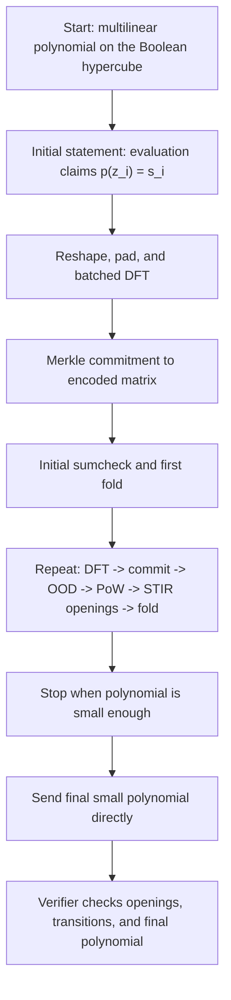

# WHIR Protocol Visualization

This note explains the end-to-end WHIR flow in this repository, then works through
the concrete `benches/whir.rs` benchmark configuration so the DFT and Merkle sizes
are easy to reason about.

## 1. What WHIR starts from

In this codebase, the prover starts from a multilinear polynomial

```text
p : {0,1}^n -> F
```

stored in **evaluation form** over the Boolean hypercube, not as symbolic coefficients.

That means:

- if `n = 24`, the prover stores `2^24 = 16,777,216` field elements
- each entry is `p(x)` for one Boolean point `x in {0,1}^24`
- together, those `2^24` values uniquely define the multilinear polynomial

In the default `bench whir` benchmark:

- base field `F = KoalaBear`
- extension field `EF = BinomialExtensionField<F, 4>`
- the polynomial is sampled randomly
- one random evaluation constraint is added to the initial statement

### 1.1 What the initial evaluation constraint is

The benchmark calls:

```text
initial_statement.evaluate(z)
```

for one random point `z in EF^24`.

That does two things:

- it computes the value `s = p(z)`
- it records the claim

```text
p(z) = s
```

inside the initial statement.

So the benchmark is not proving "just commit to a random polynomial". It is proving
"commit to a polynomial and also satisfy at least one explicit evaluation claim about it".

In this benchmark that claim is synthetic: it is sampled only to make the constraint
machinery non-empty. In a real application, the same mechanism would carry the actual
public claims the protocol cares about, for example:

- a boundary/public-input value
- a consistency check linking this polynomial to another committed object
- a value imported from another proof in a recursive composition

So the important idea is that the initial statement is the list of evaluation claims
that must remain true all the way through the folding protocol.

Source:

- [`benches/whir.rs`](/Users/miha/projects/csp/miha-whir-p3/benches/whir.rs)
- [`src/whir/constraints/statement/initial.rs`](/Users/miha/projects/csp/miha-whir-p3/src/whir/constraints/statement/initial.rs)

## 2. Whole protocol at a glance

The prover-side WHIR flow is:

```text
random multilinear polynomial p on {0,1}^n
        |
        | initial statement / initial claimed evaluations
        v
initial RS-style re-encoding via batched DFT
        |
        v
Merkle commit to the encoded matrix
        |
        v
initial sumcheck -> sample first folding randomness
        |
        v
fold polynomial from n variables to n-k variables
        |
        v
repeat per round:
  1. re-encode current folded polynomial with a batched DFT
  2. Merkle commit
  3. sample OOD points
  4. do PoW grinding
  5. answer STIR queries with Merkle openings
  6. run sumcheck to fold again
        |
        v
when polynomial is small enough:
  stop doing another DFT/Merkle layer
  send final small polynomial directly
  run final sumcheck / final query checks
```

The same flow as a compact picture:



The verifier mirrors the same Fiat-Shamir transcript:

```text
read commitment roots
-> derive the same challenges
-> verify Merkle openings
-> verify OOD / STIR consistency
-> verify sumcheck transitions
-> check the final small polynomial
```

The main implementation points are:

- initial commitment: [`src/whir/committer/writer.rs`](/Users/miha/projects/csp/miha-whir-p3/src/whir/committer/writer.rs)
- recursive proving rounds: [`src/whir/prover/mod.rs`](/Users/miha/projects/csp/miha-whir-p3/src/whir/prover/mod.rs)
- per-round state: [`src/whir/prover/round_state/state.rs`](/Users/miha/projects/csp/miha-whir-p3/src/whir/prover/round_state/state.rs)
- layout formulas for the batched DFT: [`src/whir/dft_layout.rs`](/Users/miha/projects/csp/miha-whir-p3/src/whir/dft_layout.rs)
- round/domain parameters: [`src/whir/parameters.rs`](/Users/miha/projects/csp/miha-whir-p3/src/whir/parameters.rs)

## 3. Why WHIR uses a DFT at all

The raw multilinear table has size `2^n`, but WHIR does not commit directly to that table.
Instead, it re-encodes the current polynomial as a **redundant Reed-Solomon-style codeword**
on a larger two-adic domain.

That redundancy is what gives the later proximity tests room to work:

- the verifier can query a small number of points
- the prover opens those points with Merkle proofs
- the protocol argues that the committed table is close to a valid low-degree codeword

So the DFT is the mechanism that turns:

```text
current polynomial table
```

into:

```text
larger structured evaluation table over a two-adic domain
```

which is then Merkle-committed.

### 3.1 What "redundant Reed-Solomon-style codeword" means here

In this codebase, the DFT is not taking the original hypercube points and magically
"moving them" onto a multiplicative subgroup. The actual steps are:

1. reshape the `2^n` hypercube table into a matrix
2. transpose it so there are `2^k` columns
3. treat each column as the coefficient vector of a univariate polynomial
4. append zeros to increase the target evaluation domain
5. run a DFT so each column is evaluated on a larger two-adic subgroup

The redundancy is exactly the fact that we evaluate on **more points than the number of
coefficients we started with**.

For the benchmark's initial commitment:

- each column starts with `2^20` coefficients
- each column is padded and evaluated on `2^21` subgroup points
- so each column gets a `2x` low-degree extension

Yes: in this setting, the padding is exactly how the redundancy is created.
Without padding, each column would have `2^20` coefficients and would be evaluated on
only `2^20` subgroup points. Padding with zeros extends the coefficient vector to length
`2^21`, and the DFT then evaluates that longer vector on `2^21` points instead. So the
extra `2^20` evaluation points are the concrete redundancy.

Across all `16` columns:

- raw multilinear table size = `2^24`
- committed codeword size = `2^25`
- redundancy factor = `2^25 / 2^24 = 2`

Later rounds become much more redundant:

| Stage | Raw polynomial table | Committed domain | Redundancy factor |
|---|---:|---:|---:|
| Initial commitment | `2^24` | `2^25` | `2` |
| Round 0 | `2^20` | `2^22` | `4` |
| Round 1 | `2^16` | `2^21` | `32` |
| Round 2 | `2^12` | `2^20` | `256` |
| Round 3 | `2^8` | `2^19` | `2,048` |

That is the concrete sense in which the codeword is "redundant": the committed table
contains far more values than the minimal raw folded polynomial table.

### 3.2 What `rho` is

The symbol `rho` in this note is shorthand for:

```text
rho = starting_log_inv_rate
```

So the initial inverse rate is:

```text
2^rho
```

In the benchmark, `rho = 1`, so the initial inverse rate is `2`. That is why the
initial committed domain is twice as large as the raw multilinear table:

```text
2^(24 + rho) = 2^25
```

If `rho = 2`, the initial codeword would be `4x` larger than the raw table.

## 4. Small toy reshape example

Before looking at the real benchmark sizes, here is a tiny example.

Take:

- `n = 6`
- first-round folding factor `k = 2`
- starting log inverse rate `rho = 1`

Here `rho = 1` means the initial codeword is evaluated on a domain that is `2x`
larger than the minimal unpadded one.

Then:

- polynomial table size = `2^6 = 64`
- batch count = `2^k = 4`
- base height = `2^(n-k) = 16`
- padded height = `2^(n+rho-k) = 32`

The code starts from a flat vector of length 64 and reshapes it like this:

```text
flat evaluation vector, length 64
        |
        | RowMajorMatrixView::new(..., width = base_height = 16)
        v
pre-transpose matrix: 4 rows x 16 cols
        |
        | transpose
        v
post-transpose matrix: 16 rows x 4 cols
        |
        | pad rows to 32
        v
padded matrix: 32 rows x 4 cols
        |
        | run one DFT per column
        v
4 FFT streams, each of length 32
```

So:

- width after transpose = `2^k` = number of parallel FFT streams
- height after padding = FFT size per stream

This is exactly what the real benchmark does, just at much larger sizes.

## 5. Concrete benchmark instance

The default `bench whir` parameters are:

- `num_variables = 24`
- `folding_factor = Constant(4)`
- `starting_log_inv_rate = 1`
- `rs_domain_initial_reduction_factor = 3`

Source:

- [`benches/whir.rs`](/Users/miha/projects/csp/miha-whir-p3/benches/whir.rs)

### 5.1 Initial polynomial

The benchmark constructs:

```text
p : {0,1}^24 -> KoalaBear
```

with:

- `2^24 = 16,777,216` evaluations
- one random initial evaluation constraint added to the statement

So the starting object is a dense evaluation table of 16.7 million field elements.

Concretely, the added claim is:

```text
pick random z in EF^24
compute s = p(z)
record the constraint p(z) = s
```

That is the object consumed by the initial sumcheck. The protocol must preserve this
claim while it keeps folding the polynomial into smaller ones.

### 5.2 Initial commitment DFT

For commitment, the layout formulas are:

```text
batch_count   = 2^k0
base_height   = 2^(n-k0)
padded_height = 2^(n+rho-k0)
```

With `n = 24`, `k0 = 4`, `rho = 1`:

- batch count = `2^4 = 16`
- base height = `2^(24-4) = 2^20 = 1,048,576`
- padded height = `2^(24+1-4) = 2^21 = 2,097,152`

So the commitment DFT is:

```text
16 FFTs of size 2,097,152
```

The total committed Reed-Solomon domain size is:

```text
16 * 2,097,152 = 33,554,432 = 2^25
```

which matches:

```text
starting_domain_size = 2^(num_variables + starting_log_inv_rate) = 2^25
```

That is the first big reason the DFT is expensive: even though the original polynomial
has `2^24` values, the committed codeword already has `2^25` values because of the
initial blowup factor `2^rho = 2`.

### 5.3 Why the FFT is split into 16 streams

The initial folding factor is `k = 4`, so WHIR groups the polynomial as if it were
already preparing to fold 4 variables at once.

That gives:

- `2^k = 16` independent streams
- each stream carries the remaining `24 - 4 = 20` dimensions

So you can think of the initial DFT as:

```text
one 2^25-sized codeword
    =
16 structured columns
    x
one two-adic subgroup of size 2^21 per column
```

The code uses the second viewpoint because it is much more efficient to run as a
batched matrix DFT.

## 6. Round-by-round benchmark numbers

For `Constant(4)`, this configuration has:

- 4 proving rounds with DFT + Merkle commitment
- then a final direct phase once only 4 variables remain

The table below tracks the polynomial that is being re-encoded at each stage.

| Stage | Current polynomial | Raw table size | New committed domain size | Inverse rate used for new commitment | DFT workload |
|---|---|---:|---:|---:|---|
| Initial commitment | `p : {0,1}^24 -> F` | `2^24 = 16,777,216` | `2^25 = 33,554,432` | `2` | `16 x 2,097,152` |
| Round 0 | folded polynomial on 20 vars | `2^20 = 1,048,576` | `2^22 = 4,194,304` | `4` | `16 x 262,144` |
| Round 1 | folded polynomial on 16 vars | `2^16 = 65,536` | `2^21 = 2,097,152` | `32` | `16 x 131,072` |
| Round 2 | folded polynomial on 12 vars | `2^12 = 4,096` | `2^20 = 1,048,576` | `256` | `16 x 65,536` |
| Round 3 | folded polynomial on 8 vars | `2^8 = 256` | `2^19 = 524,288` | `2,048` | `16 x 32,768` |
| Final direct phase | folded polynomial on 4 vars | `2^4 = 16` | no new Merkle layer | not applicable | send final polynomial directly |

Two important patterns show up here:

1. The polynomial table shrinks very fast.
   Every fold by `k = 4` removes 4 Boolean variables, so the raw evaluation table
   shrinks by a factor of `16`.

2. The committed domain shrinks much more slowly.
   After round 0 it drops by `2^3 = 8`, then by only `2` each later round.

Because of that, the effective inverse rate keeps increasing:

```text
2 -> 4 -> 32 -> 256 -> 2048
```

That is why later rounds still use large FFTs even though the underlying polynomial
has far fewer variables.

## 7. Why the subgroup has to be so big

There are really two related sizes:

1. **Raw polynomial table size**

```text
2^(current number of variables)
```

2. **Committed Reed-Solomon domain size**

```text
raw table size * inverse_rate
```

The DFT operates on the second size, not the first one.

For the initial benchmark commitment:

- raw table size = `2^24`
- inverse rate = `2`
- committed domain size = `2^25`

Then, because the DFT is batched into `2^k = 16` streams:

```text
per-stream subgroup size = committed domain size / 16 = 2^21
```

Equivalently, the initial commitment DFT uses a two-adic subgroup

```text
H = <omega>,  |H| = 2^21
```

for each of the `16` batched columns, where `omega` is a `2^21`-st root of unity in
the base field. This is the concrete "group subdomain on which the DFT works" in the
benchmark's first commitment.

### 7.1 How the subgroup is chosen concretely

For a DFT of length `N`, the backend needs a multiplicative subgroup of size `N`.
For radix-2 WHIR, `N` is always a power of two, so it uses a two-adic subgroup.

The choice is:

```text
N = padded_height
H = <omega>
omega = F::two_adic_generator(log2 N)
```

For the initial benchmark commitment:

- `N = 2^21`
- `F = KoalaBear`
- so the subgroup generator is `omega = KoalaBear::two_adic_generator(21)`

And in this field implementation that call is just a table lookup into
`KoalaBearParameters::TWO_ADIC_GENERATORS[21]`.

So, concretely, the implementation chooses:

```text
omega = KoalaBear::two_adic_generator(21)
```

and then the DFT subgroup is

```text
H = { 1, omega, omega^2, ..., omega^(2^21 - 1) }.
```

In the checked-out `plonky3` source, the precomputed table entry at index `21` is the
constant `0x484ef19b`, which is the field element used internally for that generator.

KoalaBear has two-adicity `24`, so subgroups up to size `2^24` exist. That is why a
`2^21` subgroup is available here.

This is the important conceptual jump:

- the prover starts with evaluations on the Boolean hypercube `{0,1}^24`
- WHIR reshapes those values into coefficient vectors of `16` univariate column polynomials
- the DFT then evaluates those column polynomials on the multiplicative subgroup `H`

So the subgroup is not "already present" in the original witness. It is introduced by
the Reed-Solomon encoding step.

So the answer to "why does the DFT subgroup have to be so big?" is:

- WHIR is not just interpolating the original multilinear table
- it is building a **larger redundant codeword**
- that redundancy is required for soundness of the later proximity tests
- the matrix decomposition then turns that large domain into `2^k` FFT columns

In later rounds the same idea holds:

- current folded polynomial has fewer variables
- but WHIR still keeps a large code domain compared to the raw table
- therefore the per-column subgroup remains large

## 8. Why the benchmark uses `k = 4`

The folding factor `k` controls three things at once:

- how many variables disappear in one fold
- how many DFT columns there are: `2^k`
- how many values sit in one opened row / one Merkle leaf row

For the benchmark's initial commitment, keeping `n = 24` and `rho = 1`:

| `k` | Batch count `2^k` | FFT size per column `2^(24+1-k)` | Post-commitment proving rounds | Opened row width |
|---:|---:|---:|---:|---:|
| `2` | `4` | `2^23 = 8,388,608` | `8` | `4` |
| `4` | `16` | `2^21 = 2,097,152` | `4` | `16` |
| `8` | `256` | `2^17 = 131,072` | `2` | `256` |

So the tradeoff is:

- smaller `k` means fewer columns but much taller FFTs and many more rounds
- larger `k` means much shorter FFTs and fewer rounds, but far wider Merkle rows and much heavier per-query openings

Why `k = 4` is a reasonable middle ground here:

- `k = 2` would make the FFTs `4x` taller than `k = 4`
- `k = 8` would make each opened row contain `256` field elements instead of `16`
- `k = 4` keeps the FFTs large but manageable while avoiding extremely fat Merkle openings

There is also an implementation constraint in this repository:

- `rs_domain_initial_reduction_factor` must be at most the first-round folding factor

So with the current benchmark setting `rs_domain_initial_reduction_factor = 3`, choosing
`k = 2` would not even be a valid configuration without also lowering that reduction factor.

## 9. Is the final step like FRI?

Conceptually, yes: both protocols eventually stop committing to ever more layers and
switch to checking a small residual object directly.

But it is not identical.

In this `whir-p3` implementation:

- the prover stops once the remaining multilinear polynomial is small enough
- the cutoff is `MAX_NUM_VARIABLES_TO_SEND_COEFFS = 6`
- the prover sends the final small polynomial explicitly as `final_poly`
- the verifier checks the last STIR constraints directly on that small polynomial and
  also checks the final sumcheck consistency relation

So the role is similar to FRI's "final small polynomial" step, but the object is
different:

- FRI ends with a small univariate low-degree object over a large evaluation domain
- WHIR here ends with a small multilinear polynomial over a small Boolean cube

For the default benchmark, the final object has `4` variables, so the verifier receives
all `2^4 = 16` final evaluations directly.

## 10. Where Merkle commitments fit

Each batched DFT produces a matrix whose total number of entries equals the current
committed Reed-Solomon domain size. That matrix is then Merkle-committed:

```text
current polynomial table
    -> batched DFT / RS re-encoding
    -> encoded matrix
    -> Merkle root
```

Later, STIR queries open selected rows from that committed matrix:

```text
verifier challenge index
    -> open row with open_batch(...)
    -> return row values + Merkle authentication path
```

That is the commit/open loop around:

- `commit_matrix(...)`
- `open_batch(...)`

## 11. Why PoW grinding is needed

The proof-of-work step happens **after** the prover has committed to the current matrix
and sent the round's OOD answers, but **before** the STIR query indices are sampled.

That ordering is the whole point.

### 11.1 Interactive protocol vs Fiat-Shamir

In a truly interactive protocol, the timeline would be:

1. prover sends the commitment
2. verifier flips fresh randomness
3. verifier sends the random challenges
4. prover answers those challenges

That model already protects the verifier: once the prover has sent the commitment, it
cannot know in advance which random queries the verifier will choose next.

In Fiat-Shamir, there is no live verifier sending randomness. Instead, the challenges are
derived from the transcript hash. So the prover can locally simulate:

1. build a candidate commitment
2. hash the transcript
3. see which STIR/OOD/sumcheck challenges that commitment would generate

That is the source of the problem. The prover is no longer forced to commit blindly and
then wait for outside randomness. It can cheaply test many candidate transcripts unless
the protocol adds some extra cost.

Without PoW, a cheating prover could do the following:

1. build one candidate commitment
2. look at the transcript-derived query positions it would lead to
3. if those queries look "easy", keep it
4. if those queries look dangerous, try a different commitment
5. repeat until the sampled queries miss the places where the commitment is bad

That attack is usually called commitment-shopping or challenge-mining.

The PoW step makes each retry expensive. In this code:

- the prover runs `challenger.grind(pow_bits)` after committing
- the witness is stored in `pow_witness`
- the verifier later checks it with `challenger.check_witness(...)`
- only after that does the transcript move on to generating the STIR queries

So PoW is not there to prove algebra. It is there to make it computationally expensive
for the prover to bias the random query locations by repeatedly trying new commitments.

If a round has `pow_bits = 0`, this step is skipped.

## 12. STIR queries in more detail

STIR queries are the in-domain spot checks against the currently committed Reed-Solomon
matrix. They are the main way the verifier samples a few places in a huge committed table
instead of reading the whole thing.

There are three concrete steps:

### 12.1 Sample row indices

For a round with:

- old committed domain size `domain_size`
- current folding factor `k`

the query sampler works over the folded row domain of size:

```text
folded_domain_size = domain_size / 2^k
```

So in round 0 of the default benchmark:

- `domain_size = 2^25`
- `k = 4`
- query indices live in `[0, 2^21)`

Those indices are sampled by `get_challenge_stir_queries(...)`, then sorted and deduplicated.

### 12.2 Open the corresponding rows

The committed matrix for that round has:

- height = `2^21`
- width = `2^4 = 16`

So each sampled index asks for one matrix row of length `16`.

For a sampled row index `i`, the prover sends:

- the `16` row values
- the Merkle authentication path proving that this row really belongs to the committed root

That is the `open_batch(i, ...)` call.

### 12.3 Collapse the row into one folded value

The opened row is not used as `16` unrelated numbers.

Instead, WHIR interprets that row as the evaluation table of a small `k`-variable
multilinear polynomial over the Boolean cube `{0,1}^k`.

For `k = 4`, that means:

- one row
- equals `16 = 2^4` Boolean-cube evaluations
- of one small 4-variable multilinear polynomial

Both prover and verifier then evaluate that 16-entry table at the round's folding
randomness `r in EF^4`.

That produces one folded value:

```text
row values on {0,1}^4
    -> evaluate at r
    -> one folded value in EF
```

The verifier attaches that folded value to the corresponding domain point

```text
x_i = folded_domain_gen^i
```

and collects all such pairs into a `SelectStatement`.

So one STIR query really means:

- choose one random row of the committed RS matrix
- verify it against the Merkle root
- fold that row down to one value using the current randomness
- use that value as a constraint linking the previous commitment to the next folded polynomial

This is why STIR queries matter: they are the concrete bridge between one committed layer
and the next folded layer. If the prover lies about many rows, random STIR queries should
hit those bad rows with noticeable probability.

### 12.4 Relation between OOD and STIR

The protocol uses both OOD and STIR checks, but they are different:

- OOD checks ask for evaluations at random points not tied to committed row indices
- STIR checks ask for actual row openings inside the committed Reed-Solomon matrix

So OOD checks algebraic consistency away from the committed grid, while STIR checks
consistency on randomly sampled committed rows.

## 13. Useful source map

- benchmark configuration:
  [`benches/whir.rs`](/Users/miha/projects/csp/miha-whir-p3/benches/whir.rs)
- DFT shape formulas:
  [`src/whir/dft_layout.rs`](/Users/miha/projects/csp/miha-whir-p3/src/whir/dft_layout.rs)
- reshape/pad/DFT execution path:
  [`src/whir/dft_backend.rs`](/Users/miha/projects/csp/miha-whir-p3/src/whir/dft_backend.rs)
- protocol/round/domain parameters:
  [`src/whir/parameters.rs`](/Users/miha/projects/csp/miha-whir-p3/src/whir/parameters.rs)
- folding schedule and final direct-send cutoff:
  [`src/parameters/mod.rs`](/Users/miha/projects/csp/miha-whir-p3/src/parameters/mod.rs)
- initial commitment:
  [`src/whir/committer/writer.rs`](/Users/miha/projects/csp/miha-whir-p3/src/whir/committer/writer.rs)
- proving rounds:
  [`src/whir/prover/mod.rs`](/Users/miha/projects/csp/miha-whir-p3/src/whir/prover/mod.rs)
- per-round state and first fold:
  [`src/whir/prover/round_state/state.rs`](/Users/miha/projects/csp/miha-whir-p3/src/whir/prover/round_state/state.rs)
- two-adic DFT semantics:
  [`dft/src/traits.rs`](/Users/miha/.cargo/git/checkouts/plonky3-7d8a3b21a665a86f/c38eb05/dft/src/traits.rs)
- KoalaBear subgroup generators and two-adicity:
  [`koala-bear/src/koala_bear.rs`](/Users/miha/.cargo/git/checkouts/plonky3-7d8a3b21a665a86f/c38eb05/koala-bear/src/koala_bear.rs)
- STIR query sampling:
  [`src/whir/utils.rs`](/Users/miha/projects/csp/miha-whir-p3/src/whir/utils.rs)
- commitment parsing and OOD reconstruction:
  [`src/whir/committer/reader.rs`](/Users/miha/projects/csp/miha-whir-p3/src/whir/committer/reader.rs)
- verifier-side STIR checks and PoW verification:
  [`src/whir/verifier/mod.rs`](/Users/miha/projects/csp/miha-whir-p3/src/whir/verifier/mod.rs)
- proof structure for query openings and PoW witnesses:
  [`src/whir/proof.rs`](/Users/miha/projects/csp/miha-whir-p3/src/whir/proof.rs)
